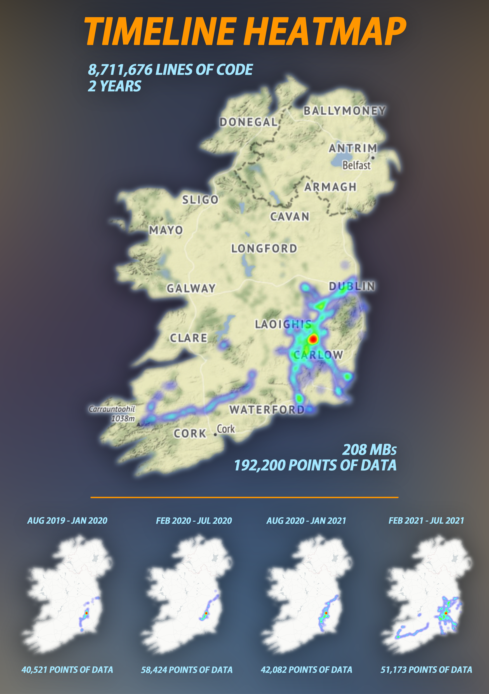

<p align="center"></p>

Project work for a Data Self-Portrait, tasked with collecting data from oneself and creating a striking visualisaiton. This script takes 2 years of Google Timeline data from between August 2019 and August 2021, it then reads through it's 8,711,676 lines of codes and extracts location data which it displays as interactive heatmaps. I've taken these heatmaps and recorded their images to create an infographic poster as my final delivery. 

This script uses Python, Folium and OpenStreetMap.

## Instructions: Create Your Own Heatmaps

### Location Data

If you have Google location history turned on you will find your data [here](https://takeout.google.com/).

Scroll until you find "Location History", by default this will be a JSON file. KML and GPX are also compaitable with this script.

### Clone Repo, Install Python, Install Dependencies

With [Python](https://www.python.org/downloads/) installed open command prompt and [navigate](https://riptutorial.com/cmd/example/8646/navigating-in-cmd) to the directory containing this repo's files, then enter:

```shell
pip install -r requirements.txt
```

### Add Location History, Run Script

Add your location history file to the repo folder and in the same command prompt, enter:

```shell
python timeline-heatmap.py "Location History.json"
```

If using KML or GPX just replace the Location History.json from above with the name of your file.

#### Other Arguments

```shell
  timeline-heatmap.py [--min-date YYYY-MM-DD] [--max-date YYYY-MM-DD]
                      [--map MAP] [-z ZOOM_START] [-r RADIUS]
                      [-b BLUR] [-mo MIN_OPACITY] [-mz MAX_ZOOM]


  --min-date YYYY-MM-DD
                        The earliest date from which you want to see data in the heatmap.
  --max-date YYYY-MM-DD
                        The latest date from which you want to see data in the heatmap.
  --map MAP, -m MAP     The name of the map tiles you want to use. 
  -z ZOOM_START, --zoom-start ZOOM_START
                        The initial zoom level for the map. (default: 6)
  -r RADIUS, --radius RADIUS
                        The radius of each location point. (default: 7)
  -b BLUR, --blur BLUR  The amount of blur. (default: 4)
  -mo MIN_OPACITY, --min-opacity MIN_OPACITY
                        The minimum opacity of the heatmap. (default: 0.2)
  -mz MAX_ZOOM, --max-zoom MAX_ZOOM
                        The maximum zoom of the heatmap. (default: 4)
```

#### Examples 
To set a date range:

```shell
python timeline-heatmap.py --min-date 2019-08-01 --max-date 2021-08-31 "Location History.json"
```

To change the map:

```shell
python timeline-heatmap.py --map StamenTerrain "Location History.json"
```
Full list of built in tiles [here](https://github.com/python-visualization/folium/tree/main/folium/templates/tiles).

### View Your Heatmap

The script will generate a HTML file named `heatmap.html`. This file will automatically open in your browser once the script completes.
You will also see how many data points were combed through output in the terminal.
